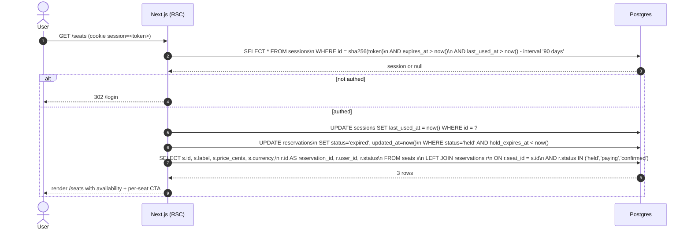

# List seats (with lazy hold expiry)

The seats page is the most-hit read path. It does two things people often forget:

1. **Bumps `last_used_at` on the session** so sliding-window expiry works.
2. **Lazy-expires stale holds** so abandoned holds free up the seat immediately on the next read, not "eventually after the sweeper runs".

## Why lazy expiry on every read

If you only expire holds via a periodic sweeper, an abandoned hold blocks the seat until the next sweeper tick. At this scale that's user-visible. Doing the `UPDATE` on every read costs almost nothing (the partial index `reservations_hold_expiry_idx` covers it) and gives users immediate availability.

The sweeper still exists — it's the backstop that handles seats no-one is currently looking at, and it surfaces stuck-`paying` reservations for operator attention.

## Why bumping `last_used_at` is on the request path

Per ADR 0004, the session is valid iff `now < expires_at` **and** `now - last_used_at < 90d`. Bumping `last_used_at` per authenticated request implements the sliding window. The cost is one `UPDATE` per page load; for this scope, acceptable. At scale we'd move it off the request path (write-behind queue with debouncing).
