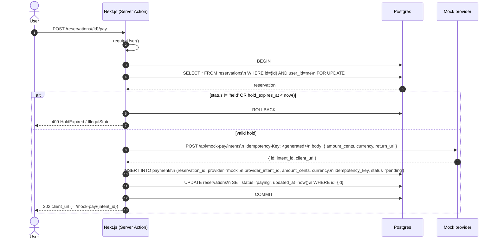

# Begin payment (held → paying)

The user has a `held` reservation. They click **Pay**. We must, atomically:

1. Verify the hold is still valid (`status='held'` and `hold_expires_at > now()`).
2. Create a payment intent at the provider.
3. Insert a `payments` row tying that intent to this reservation.
4. Advance the reservation to `paying`.
5. Redirect the user to the provider's checkout URL.

## Notes

- The `FOR UPDATE` lock on the reservation row prevents two simultaneous "Pay" clicks from both creating intents.
- The provider call (`POST /api/mock-pay/intents`) is **inside** the transaction. This is the right shape for this scope: if the provider call fails, we roll back and the reservation stays `held`. The trade-off is that the provider call holds the DB row lock; if it took a long time, that'd be a problem. In the mock, it's instant.

  In production with real Stripe, the typical pattern is: create the intent outside the transaction with an idempotency key, then in a short DB transaction persist the result. We accept the simpler shape here and document the difference.

- The `idempotency_key` we send to the provider is generated by us and stored locally. If we retried "create intent" after a transient failure, the same key would reach the provider; the provider's response would also be idempotent, and we'd get back the same intent ID — no duplicate intents.

- We do **not** lock the seat row during `beginPayment`. The reservation row is the relevant lock; the seat row's row lock is only meaningful in `createHold`.
