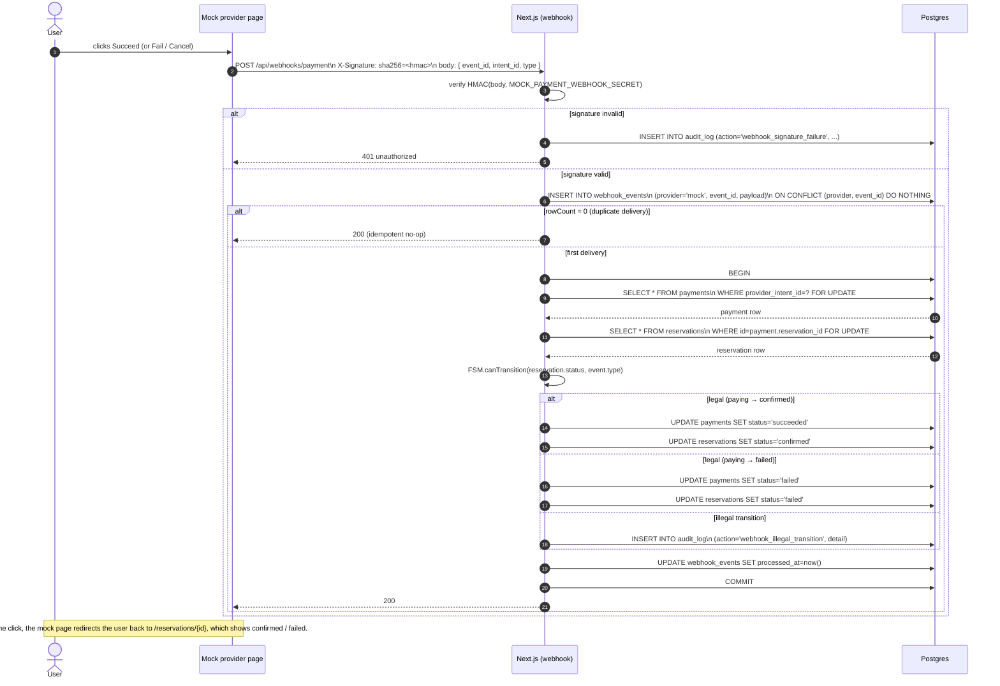

# Webhook handler (confirm / fail)

The mock provider POSTs `/api/webhooks/payment` once the user clicks **Succeed** or **Fail** on the checkout page. The handler is the most security-sensitive piece of code in the system because it's the only **unauthenticated** entry point that mutates real state.

## Why each step exists

| Step | Why |
|---|---|
| HMAC verify first | Reject unauthenticated callers immediately, before touching the DB. |
| `INSERT ... ON CONFLICT DO NOTHING` | Inbound idempotency. The first delivery wins; a re-delivery returns 200 without re-applying. |
| `FOR UPDATE` on payment **and** reservation | Serialise against any concurrent state change (e.g., a stuck-paying reconciliation running at the same time). |
| FSM legality check | A `paying → confirmed` event arriving for an already-`expired` reservation is illegal; we log it to `audit_log` for operator attention rather than silently writing a bad transition. |
| `UPDATE webhook_events SET processed_at` | Distinguishes "received but processing failed" from "processed". |
| Always return 200 on success or duplicate | Tells the provider not to retry. We return 5xx only for transient failures (DB unavailable). 4xx is for permanent failures the provider should not retry (bad signature, malformed body). |

## What the test proves

`tests/integration/webhook-idempotency.test.ts` posts the **same signed event 5 times in parallel** to the handler. Assertions:

- The reservation transitions exactly once (`paying → confirmed`).
- Exactly one row in `webhook_events` exists for that `event_id`.
- All five HTTP responses are 200.
- No `audit_log` entries for illegal transitions are written.
