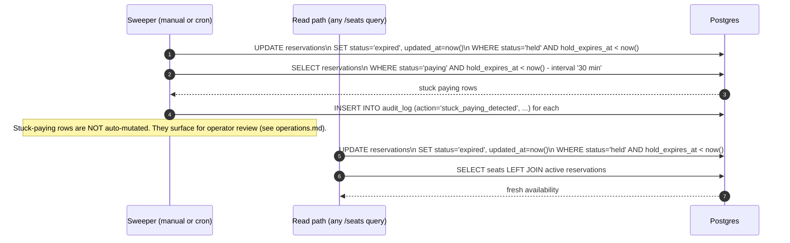

# Hold expiry (lazy on read + sweeper backstop)

Holds time out. The system has two complementary mechanisms.

## Two mechanisms, one invariant

1. **Lazy expiry on read.** Every `/seats` query starts with the `UPDATE reservations SET status='expired'` for stale held rows. This is the **primary** mechanism — it means abandoned holds free up the seat **immediately** on the next visitor, not "eventually".

2. **Sweeper script (`scripts/sweep-expired.ts`).** A backstop. Runs the same `UPDATE`, plus a second pass that surfaces stuck `paying` reservations to an operator. Designed for cron (`* * * * * pnpm sweep` in prod), called manually in dev.

The lazy path is what makes the assessment runnable without setting up cron. The sweeper exists so the design is honest about the long-tail case (no-one looks at the page for hours, while a hold sits there).

## Why `paying` is not auto-expired

A `paying` row is associated with an in-flight payment intent at the provider. We do not unilaterally abandon it because:

- The payment might genuinely have succeeded and the webhook is delayed or lost.
- Marking it `expired` without checking the provider could create a real-world double-charge if the user retries.

Instead, the sweeper **flags** stuck `paying` rows in `audit_log` (`action='stuck_paying_detected'`) after a longer threshold (30 min by default). An operator then runs `pnpm reconcile <reservation_id>` to query the provider and apply the right terminal state.

For an assessment we accept the unlikelihood of this state; the operator workflow is documented in `operations.md`.

## What the test proves

`tests/integration/hold-expiry.test.ts`:

- Create a hold with `hold_expires_at` set 1 minute in the past.
- Call `listSeats`.
- Assert: the original reservation is now `status='expired'`, and the seat appears available in the response.

This proves the lazy expiry path works without depending on the sweeper having run.
