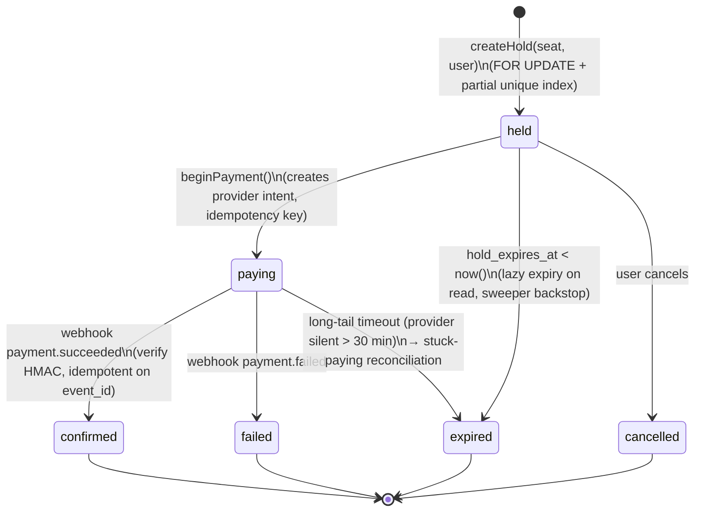

# Reservation state machine

The reservation FSM is the heart of the correctness story. Every active reservation occupies its seat; every terminal reservation does not. The partial unique index in `schema.sql` only includes the active states (`held`, `paying`, `confirmed`), so the database itself prevents two reservations from being active for the same seat at once.

## Active vs terminal

- **Active** (occupies the seat): `held`, `paying`, `confirmed`.
- **Terminal** (does not occupy the seat): `expired`, `cancelled`, `failed`. `confirmed` is also terminal in the sense that no further transitions are legal — the seat is permanently allocated for this event.

## Legal transitions (enforced in code)

| From | To | Triggered by |
|---|---|---|
| (none) | `held` | `createHold` |
| `held` | `paying` | `beginPayment` |
| `held` | `expired` | TTL elapsed (lazy expiry or sweeper) |
| `held` | `cancelled` | user cancels |
| `paying` | `confirmed` | webhook `payment.succeeded` |
| `paying` | `failed` | webhook `payment.failed` |
| `paying` | `expired` | long-tail timeout, reconciled |

Any other transition is logged as `webhook_illegal_transition` or `state_transition_violation` in `audit_log` and the request is rejected. The pure FSM in `src/lib/reservation/state.ts` is the single source of truth for transition legality.
